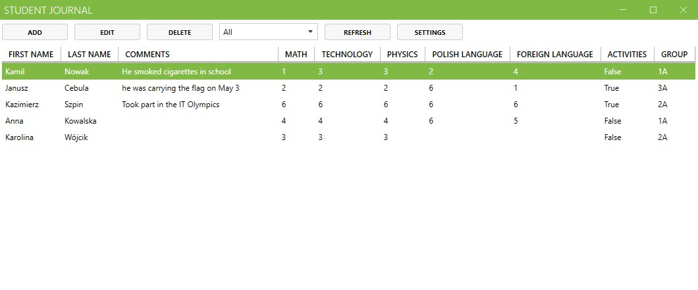
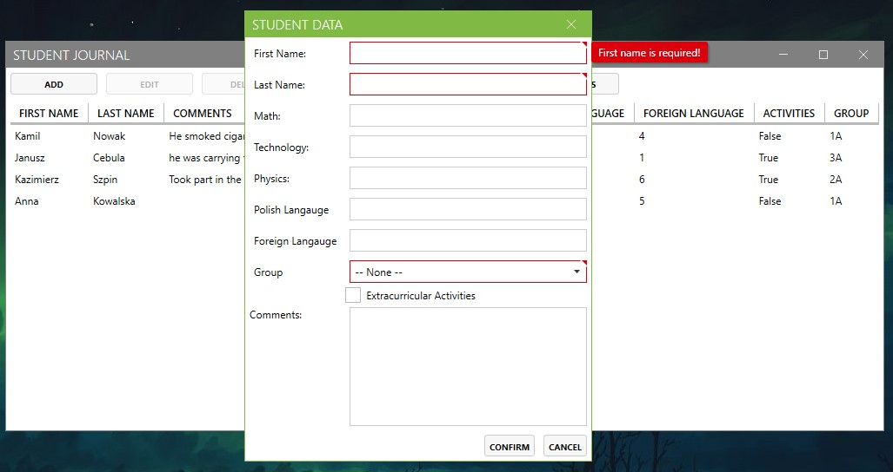
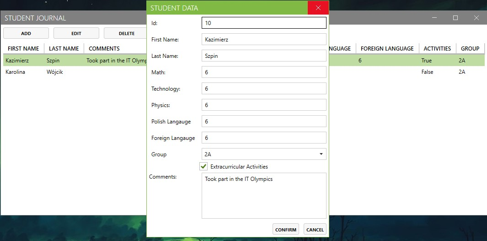
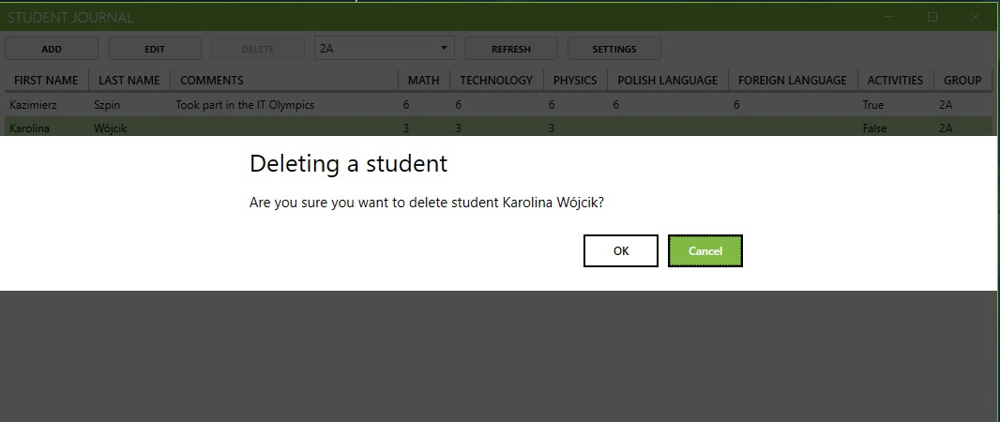
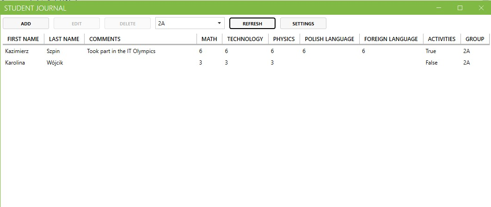
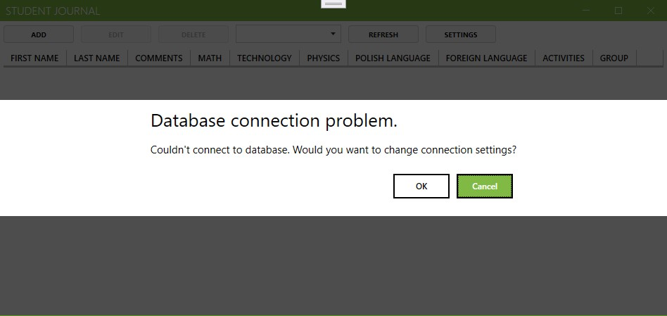
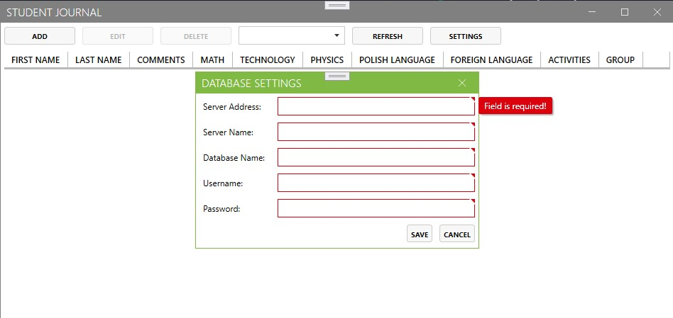

# Student Journal

## Note
This is a learning project. I do not recommend using this app. Your database password is not secured.

## Requirements
- **Operating System:** Windows
- **.NET Framework** 4.7.2
- **Minimum screen resolution:**
    - Width: 950
    - Height: 450
- **Minimum space required after installation:** 6.9 MB

## Download
Download the installer from the GitHub [release page](https://github.com/Tymisko/student-journal/releases).

## Technologies
- Entity Framework
- MVVM pattern
- MahApps.Metro
- Costura.Fody
- InnoSetup
- Eazfuscator.NET

## Presentation

### Splashscreen

### MainWindow

### Adding Student

### Editing student

### Removing student

### Filtering by group

### Database connection problem

### Datbase settings
